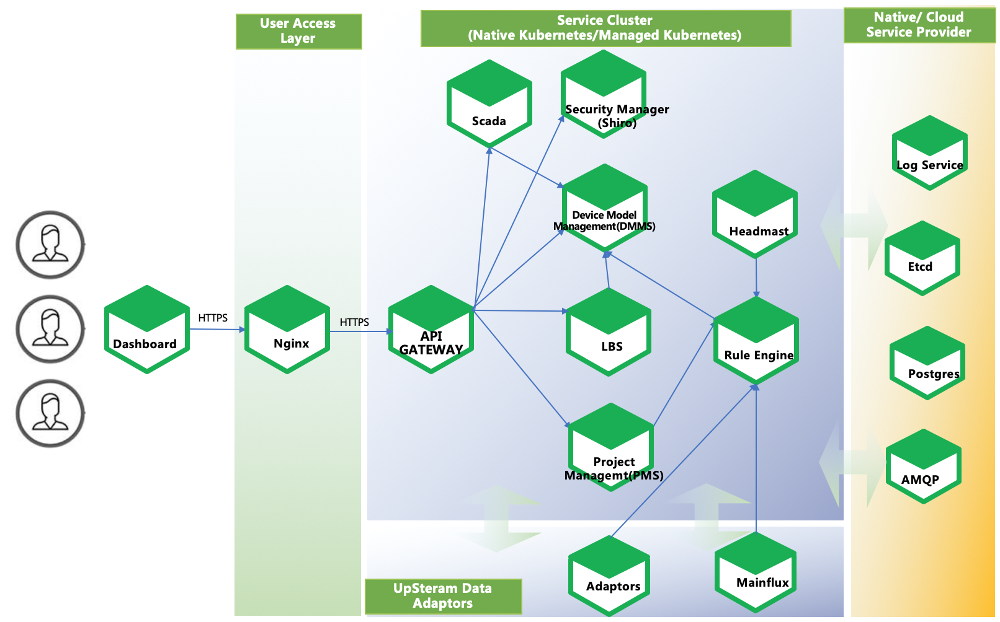

# Overview

  

Pandas is device managment and modeling platform which can be deployed in any environments to provide the following features.

* Integrate with 3rd-party broker, for example, mainflux to provide device connection. 
* Device management
* Device model management, user can creating device model using web-frontend.
* Project management,
* Full featured IoT rule engine
* Location Based Service
* Display project's realtime device status based on device model
* SCADA

Pandas is designed and implemented based on micro service architecture,which include the following components.

* Dashboard, the web console to manage all objects(User/Project/Workshop/Device/RuleChain).
* ApiMachinery, the API gateway.
* Dmms: Device model management service.
* Pms: Project management service.
* Rulechain: Rule chain service

### Building

> git clone https://github.com/cloustone/pandas  
> cd $GOPATH/src/github.com/cloustone/pandas  
> make 

### Statrup 

Start pandas  in docker-compose mode  (in future)
> ./deploy.sh dockercompose up  

### 3rd-Party Software

